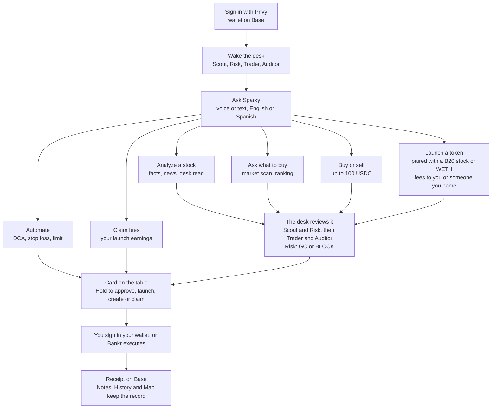

# PerkOS

Desktop door into PerkOS infrastructure. You open an app, say **Hey Sparky**, and a desk of specialized agents that live on PerkOS drafts work on **Base**. You approve. Nothing spends without you.

The runtime is the CPU. PerkOS is the OS. This app is the door. Desks are the apps that run inside it. The first desk is **PerkOS Floor Desk**: tokenized stocks on Base, worked by Scout, Risk, Trader and Auditor, with Sparky as the voice of PerkOS. That desk is the solution presented at Runtime Agent Week (New York, 19 September 2026).

They draft. You approve.

## What this is

- A native macOS app (`PerkOS.app`, Apple Silicon) built from an Electron shell and a Next.js 16 app that runs a local server on 127.0.0.1 for its own window.
- Wallet login with Privy, PerkOS session, Grok (xAI) by OAuth for chat and voice, DeepSeek agents on PerkOS infrastructure for the desk turns.
- Uniswap drafts with a Bankr second quote, 1Claw spend rail for the Trader, Chainlink and Base data for facts, PerkOS Knowledge for shared desk knowledge, a local Markdown vault for memory.
- Bankr for launching tokens paired with tokenized stocks, for automations (DCA, stop loss, limit) and for the creator fees those launches earn.
- Everything that spends, signs or changes the wallet waits for the person: hold to approve in the app, confirm in the wallet.

## What you can do

Sign in, wake the desk, ask Sparky. Six requests are understood. Four of them go through the desk (Scout and Risk first, then Trader and Auditor; Risk says GO or BLOCK when there is something to sign). Automations and fee claims are rules or collections, not decisions, so they go straight to a card. Every card waits for a two second hold.



| Say | Who works | Card | Who executes |
|---|---|---|---|
| `analyze nvidia` | the four agents (analyze mode) | Analysis card: brief, news, the desk's read | nobody, it is a read |
| `what should I buy this month` | the four agents over a market scan (advise mode) | Outlook by the Auditor, reviewed a month later | nobody |
| `buy $5 of NVDA`, `sell half my TSLA` | Uniswap or Aerodrome draft plus a Bankr second quote; the four agents (order mode); Risk GO or BLOCK | Draft card, Hold to approve | you sign in your wallet, receipt on Base |
| `launch Night Owl (OWL) paired with NVDA`, add `fees to @handle` (X, Farcaster, ENS or a wallet), `no vesting`, `quote only fees`, `degen` | Bankr checks and simulation (which also resolves the recipient); the four agents (launch mode); Risk GO or BLOCK | Launch card, Hold to launch | Bankr deploys, gas sponsored; 95% of the pool fee pays the recipient, your wallet by default |
| `dca $5 into NVDA every week`, `stop loss on TSLA at 380` | Trader drafts the prompt, no desk turn | Automation card, Hold to create | Bankr's agent, from your Bankr wallet |
| `claim my fees`, `what did I earn` | public Bankr read, no desk turn | Fees card, Hold to claim | you sign the claim, gas on Base |
| `show my automations`, `history`, `notes`, `map`, `portfolio`, `market` | the desk dock | | |
| `summarize the day` | Sparky folds the journal into the desk memory | | |

Fixed rules: nothing executes without a hold; a swap or a fee claim pays only the wallet connected in Settings; a BLOCK from Risk disables the card; every turn is kept in History and every note in the local vault.

## Layout

```
apps/web       Next.js app: the canvas, the desk, the local API (proxy.ts gates /api)
apps/desktop   Electron shell: window, per-launch API token, packaging (DMG)
apps/voice     Optional command-line voice bridge (Google speech recognition)
assets/        Source marks (see assets/README.md and NOTICE.md)
```

## Run in development

Node 22. Two npm projects, no workspace.

```
cd apps/web && npm install && cp .env.example .env.local   # fill NEXT_PUBLIC_* (see .env.example)
cd ../desktop && npm install && npm run brand              # brand the dev Electron shell (macOS, optional)
cd ../.. && npm start                                      # Electron shell; it starts the web server itself
```

`npm run dev` runs the web app alone at http://127.0.0.1:3000 (no per-launch API token in that mode). Ask the desk: `Hey Sparky`, `Wake the team`, `Analyze NVDA`, `What should I buy this month`, `Buy $3 of NVDAc`, `Launch Night Owl (OWL) paired with NVDA`, `DCA $5 into NVDA every week`, `Claim my fees`, `Show the market`, `Stop`.

## Environment

| Variable | Where | What |
|---|---|---|
| `NEXT_PUBLIC_PRIVY_APP_ID`, `NEXT_PUBLIC_WALLETCONNECT_PROJECT_ID` | build time | public ids for wallet login |
| `BASE_RPC_URL` | run time, optional | Base JSON-RPC; default public node |
| `BANKR_API_KEY` | run time, optional | Bankr key: read-only is enough for the second quote; Token Launch API and read-write for launches and automations |
| `PERKOS_API_URL`, `PERKOS_OAUTH_URL`, `PERKOS_FLEET_TEMPLATE` | run time, optional | PerkOS endpoints and desk template |
| `KNOWLEDGE_*` | run time, optional | PerkOS Knowledge tier and, for one install, the publishing token |
| `XAI_BASE_URL` | run time, optional | Grok API base |
| `PERKOS_HOME`, `PERKOS_KB_DIR`, `PERKOS_BUNDLED_KB`, `PERKOS_BRIEF_PATH` | run time, optional | local paths |

The shell sets `PERKOS_API_TOKEN`, `PERKOS_APP_VERSION`, `PERKOS_APP_BUILD` and `PERKOS_DEBUG_LOG` itself.

## What lives on your Mac

`~/.perkos-xyz/` (0700, files 0600): `settings.json` (model, effort, voice, wallet address), `perkos-session.json` and `xai-oauth.json` (session tokens), `api-token` (per-launch token for the voice bridge), `knowledge/` (your desk's vault in Markdown, Obsidian-compatible), `cache/`, `models/` (a 23 MB embeddings model), `logs/` (`perkos-app.log`, `perkos-debug.log`, and `desk-quality.jsonl` with the prompts and replies of every desk turn). Nothing in it is sent anywhere except the requests the app makes on your behalf to PerkOS, xAI, Bankr, 1Claw, Base RPC and PerkOS Knowledge.

## Package as PerkOS.app (macOS, Apple Silicon)

```
npm run package:mac --prefix apps/desktop
```

Builds the web app in production mode (`next build`, standalone output), makes the icon and the DMG background from the vertical logo, packs the shell with electron-builder and puts the desk server inside the bundle (`after-pack.cjs`). Output: `apps/desktop/release/PerkOS-<version>-arm64.dmg` and `apps/desktop/release/mac-arm64/PerkOS.app`. The app starts the bundled server with Electron's own Node, so the Mac that runs it needs no Node install.

- Build-time: `apps/web/.env.local` with the `NEXT_PUBLIC_*` values (they are inlined).
- Run-time: optional `~/.perkos-xyz/env` with server keys (`BASE_RPC_URL`, `BANKR_API_KEY`, `KNOWLEDGE_*`), same `KEY=VALUE` format. Without it the app uses the public Base RPC and PerkOS Knowledge and skips the Bankr second quote, launches and automations (fee reads and claims need no key). Keys never travel inside the bundle.
- Settings, session, vault and logs stay in `~/.perkos-xyz/` (`logs/perkos-app.log` is the server output of the packaged app). Installs from 0.2.0 kept them in `~/.perkos-floor/`; the folder is renamed on first start.

### Signing and notarization

The script signs with the first "Developer ID Application" identity in the keychain (hardened runtime, `entitlements.mac.plist`). Without one it signs ad-hoc, which only runs on the Mac that built it. Notarization, needed for other Macs to open the DMG without warnings, runs when Apple credentials are in the environment:

```
xcrun notarytool store-credentials perkos-xyz --apple-id <apple id> --team-id <team id>
APPLE_KEYCHAIN_PROFILE=perkos-xyz npm run package:mac --prefix apps/desktop
```

`store-credentials` asks for an app-specific password from appleid.apple.com. `APPLE_ID` + `APPLE_APP_SPECIFIC_PASSWORD` + `APPLE_TEAM_ID` work too.

### Releases

Versions follow semver and live in `apps/desktop/package.json` (mirrored in `apps/web/package.json`). Settings › About shows the version and the git short SHA of the build. To release:

1. Bump the version in both `package.json` files and add the entry to `CHANGELOG.md`, in a PR.
2. After the merge, tag and publish the DMG from `main`:

```
git tag v0.2.0 && git push origin v0.2.0
npm run package:mac --prefix apps/desktop
gh release create v0.2.0 apps/desktop/release/PerkOS-0.2.0-arm64.dmg --title "PerkOS 0.2.0" --notes-file <(sed -n '/## \[0.2.0\]/,/## \[0.1.0\]/p' CHANGELOG.md)
```

## Desk knowledge

The desk reasons over three layers of knowledge, so every install answers from the same base:

- **Bundled notes** in `apps/web/knowledge/desk/*.md` (what B20 tokenized stocks are, venues and sizing, the desk method). They are seeded into the local vault (`~/.perkos-xyz/knowledge/app/`) on first run and refreshed when the bundled copy is newer.
- **PerkOS Knowledge** (`knowledge.perkos.xyz`, public tier, no key): the same notes plus the daily valuation profile per asset (`floor/profiles/<TICKER>.md`). Every desk turn queries it; the install that holds `KNOWLEDGE_INGEST_TOKEN` publishes new profiles and notes for everyone else (`node scripts/publish-desk-knowledge.mjs`).
- **Local vault**: analyses, decisions, dated market outlooks and their one-month review, the desk memory.

Quality: every turn is logged to `~/.perkos-xyz/logs/desk-quality.jsonl` with prompts, replies and automatic flags; History → Quality shows it, together with the outlooks and their reviews.

## Credits

Built with Next.js, Electron, React Flow (`@xyflow/react`), Transformers.js with onnxruntime, viem and wagmi, Privy, and the IBM Plex Mono typeface. Base marks from the Base brand kit; 1Claw mark for the integration badge. See `NOTICE.md`.

## License

MIT for the code (`LICENSE`). Marks and the Sparky mascot are excluded (`NOTICE.md`). Security reports: `SECURITY.md`. Contributions: `CONTRIBUTING.md`.
